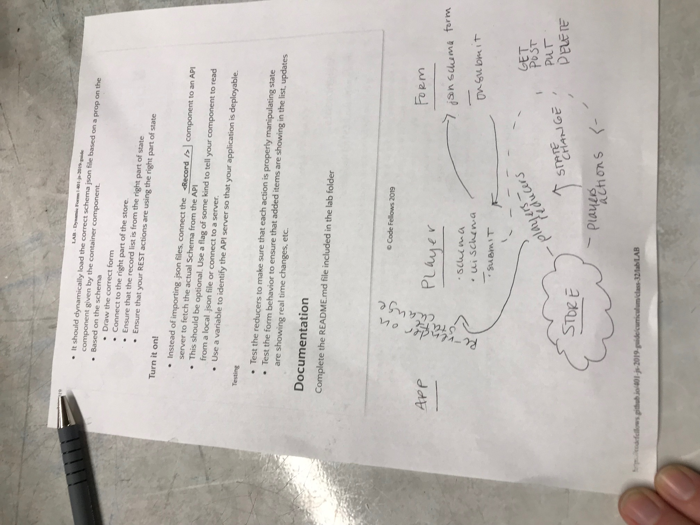

 LAB
=================================================

## 32 - Dynamic Forms

### Author: Heather Cherewaty

### Links and Resources
* [repo](https://github.com/hcherewaty/32-dynamic-forms)
* [Code Sandbox](https://codesandbox.io/s/o4pw74pq4y)

### Modules
#### `index.js` for code sandbox
##### Exported Values and Methods
* Connection to sandbox app upon visiting link established in Links and Resources.
* Content is rendered onto index.html by way of import of app.js onto index.js.
* Components (`Details`, `If`, `Then`, `Else`, `App`, `Player`) defined in components directory.
* Middleware (`reporter.js`) defined in store/middleware directory.
* Redux store, actions, and reducers defined in store directory.
* Data for forms and routes brought in from `players.json` and `schema.json`.

#### Running the app
* The react apps will start and load once the sandbox link is visited.

#### UML

